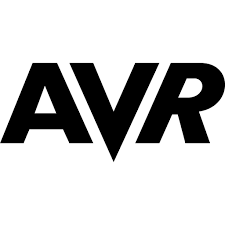

<h1 align="center">Hi , its Niv 👽</h1>
<h3 align="center">A Junior Embedded Software developer 👾</h3>

- 🗝 I’m currently working on **Data Encryption Standards as a Trainee at NiraSystem CO.**

- 🤿 and also an undergraduate Computer Engineering Student at **Qom University**

- 🔌 I have experience in working on **AVR | Arduino**

- ..I'm a **Game Addict 🎮**

<h3 align="left">Skills:</h3>

  
   
   
   
   

